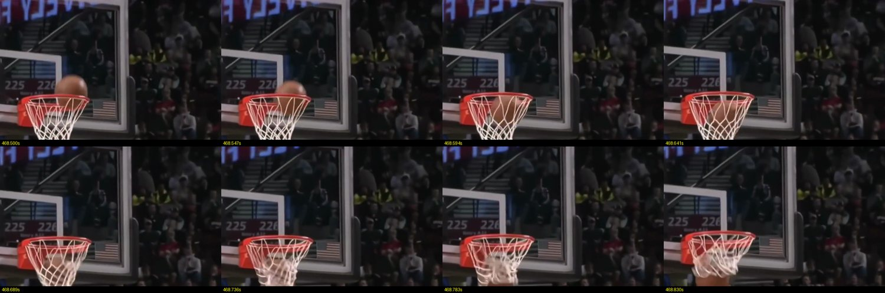
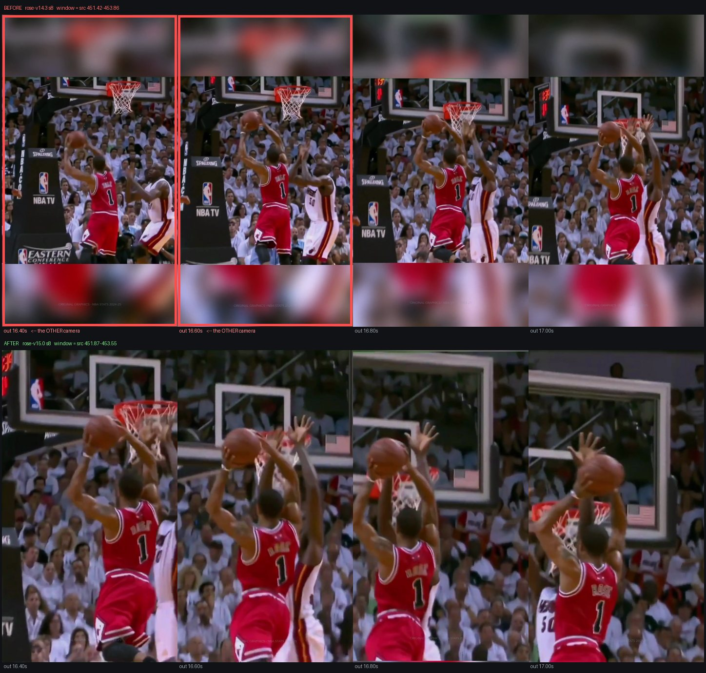

# ShortsForge

**Software that watches a half-hour basketball highlight video and edits it down to a
half-minute clip for your phone — choosing the plays, framing the players, and cutting it in
time with the music. On its own, start to finish.**

> ### ▶︎ [**Open the showcase**](index.html) — six finished reels, and the software's own view of what it is looking at.
> Five tabs: *What it is · The reels · What it sees · How it works · Why it's reliable.*
> Serve it with GitHub Pages, or just open `index.html`.

<p align="center">
  
</p>

<p align="center"><em>Eight consecutive frames — about a third of a second — of one shot
going in. Working out whether that happened, from pixels alone, is most of the problem.</em></p>

---

## What it does

Making a highlight edit by hand is slow. You watch the whole video, pick the good plays,
trim each one so the basket lands where you want it, re-frame every shot for a vertical
phone screen, and line the whole thing up with a song. An editor might spend an afternoon
on thirty seconds of video.

Give this a long highlight compilation, a player's name and a song, and it hands back a
finished vertical Short.

|  |  |
|---|---|
| **6** | finished reels, each edited entirely by the software |
| **0** | manual cuts, crops or timing tweaks in any of them |
| **1** | laptop — no cloud service, no internet, nothing sent anywhere |

## Why it is hard

Nothing in the source video tells the software what is happening. There is no scoreboard
data and no commentary it can read — just pixels, and a soundtrack the original uploader
has already mixed music over, so even the crowd noise is unreliable.

The footage is a patchwork: thirty years of broadcasts, different cameras, different
picture shapes, slow-motion replays, and camera cuts that land in the middle of a play.
From that alone it has to work out where a play begins, who has the ball, whether the shot
went in, and which two-and-a-half seconds are the good part.

**The hardest single problem is that you cannot see the ball.** During a dunk it is in the
player's hands, hidden behind his body and blurred by motion — for exactly the moment that
decides whether it counts. The ball is only visible in roughly two frames out of three, and
near the rim it can vanish entirely.

## What comes out

Six finished reels are in [`reels/`](reels/), one per player, six different songs, footage
spanning three decades. Every clip in them was chosen, trimmed, cropped and timed by the
software — including which play opens the reel, how long each shot holds, and which basket
lands on the drop.

And one more, which is the interesting one:
[`reels/rose-tracking.mp4`](reels/rose-tracking.mp4) is a reel with the software's own view
drawn on top — everyone it can see, the player the clip is about, the phone-shaped crop it
will keep, the ball, and the rim.

<p align="center">
  
</p>

<p align="center"><em>Two versions of one scene. Top: it opens on the wrong camera, the
red-boxed frames, and cuts mid-play. Bottom: the same scene after the software learned where
that camera change was.</em></p>

## How it works, in five stages

1. **It watches the whole thing** — where the crowd gets loud, where the picture moves, and
   every point where the broadcast cuts to a different camera.
2. **It finds the plays** — tracking the players and the ball, working out who has it, when
   they shoot, and whether it drops. It reads the number on the jersey, so a reel about one
   player really is about that player.
3. **It picks the best ones** — no using the same play twice from two camera angles, and
   nothing that crosses a camera cut.
4. **It cuts to the music** — measuring the song's tempo and beat positions, making every
   clip a whole number of beats long, and working backwards from the drop so the biggest
   basket lands on it.
5. **It reframes for a phone and checks its work** — the crop follows the player down the
   court, then a separate checker goes over the finished video scene by scene.

## Why the output can be trusted

Every scene that has ever shipped in one of these reels has been watched frame by frame by
a person and given a written verdict — and those verdicts are stored against **the moment
in the source video**, not against a particular edit. So a judgement made once is permanent:
if a later version reaches for the same footage, it already knows what a person thought of
it.

The final check deliberately cannot see the software's own reasoning. It is not allowed to
accept "the code thought this was a made basket" as evidence that it was. And it fails safe
— a scene nobody has looked at comes back as *unknown*, which means someone has to look.

Nothing is random, either. The same video and the same song always produce exactly the same
edit, so any change can be tested by re-rendering and comparing frame for frame.

## Built from

About 40,000 lines of Python. Four vision models run locally — one that finds people and the
ball, one for rims, one that spots camera cuts, and one that reads jersey numbers. Nothing
is sent to a server, and there is no AI writing the edit: every decision is ordinary code
that can be read, re-run and checked.

## Going deeper

- [**METHOD.md**](METHOD.md) — how correctness is established without ground truth: the
  release gate, the adjudicated scene records, and declared control arms.
- [**ARCHITECTURE.md**](ARCHITECTURE.md) — the stage-by-stage technical map.

## Viewing it locally

```bash
python serve.py
```

Then open <http://localhost:8731>. Use that script rather than `python -m http.server`,
which does not answer byte-range requests — without them Safari will not start a video at
all, and Chrome cannot seek in one.

---

*The reels are highlight footage cut to commercial music, shown as examples of what the
software produces.*
